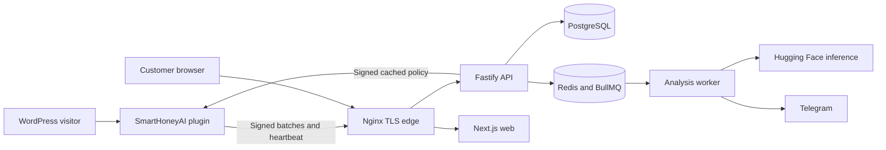

# Architecture

## System context

The central platform is the control plane. It never sits inline with normal WordPress traffic. The plugin is both sensor and local enforcement point, so a control-plane outage does not take the customer site offline.

## Trust boundaries

- **Public edge:** only Nginx binds host ports. It terminates TLS, applies request limits, adds browser security headers, and forwards known paths.
- **Application network:** web and API are reachable only by Nginx and monitoring. Browser sessions use Secure, HttpOnly cookies.
- **Data network:** PostgreSQL and Redis are internal-only. The API and worker obtain credentials from mounted secret files.
- **Monitoring network:** Prometheus, Alertmanager, and Grafana have no public routes. Operators reach Grafana with an SSH tunnel.
- **WordPress boundary:** every site has a unique credential. Requests are HMAC-authenticated with timestamp, nonce, body hash, and site/key identifiers. Policies are independently signed using Ed25519.
- **AI provider boundary:** only normalized, redacted evidence is sent to Hugging Face. IP addresses, cookies, authorization values, credentials, and session identifiers stay local.

## Runtime flow

1. An organization administrator creates a site and receives a one-hour, single-use enrollment token.
2. The plugin proves the configured WordPress URL, exchanges the token for a site ID, key ID, agent secret, and policy verification key, then stores them in protected WordPress options.
3. Inert honeypot routes capture suspicious request metadata. Sensitive fields are removed before events enter the bounded local spool.
4. WP-Cron sends idempotent batches. The API authenticates the request, rejects replayed nonces, persists events, and returns `202` after durable acceptance.
5. BullMQ processes redacted events asynchronously. Failures remain visible as pending/unavailable and never trigger a block.
6. The plugin periodically fetches a versioned, signed policy, verifies it locally, atomically replaces its cached policy, and acknowledges success or failure.
7. Cached rules are evaluated locally. Allowlist and protected ranges take precedence. When policy expires, the plugin enters monitor-only/fail-open mode.

## Data ownership and tenancy

`organizationId` is present on operational data. Authenticated service queries derive tenant scope from the server-side session, never from a client-supplied organization identifier. Site-agent credentials are scoped to exactly one site. Platform-admin actions are exceptional and audited.

PostgreSQL is the source of truth. Redis holds queues, replay nonces, rate-limit state, cache entries, and ephemeral live-event fan-out; losing Redis may delay analysis but must not lose already accepted events.

## Availability and scaling

The pilot uses one Ubuntu host and is designed for 25 events/second sustained and 100 events/second bursts. API ingestion is separated from analysis so Hugging Face or Telegram latency does not block WordPress. Scale API and worker replicas independently only after verifying migration locking, queue concurrency, SSE fan-out, and shared rate-limit behavior.

This topology has a host-level single point of failure. The target is RPO 24 hours and RTO four hours using encrypted off-host backups. Multi-host PostgreSQL, Redis HA, object storage, and a load balancer are deferred.

